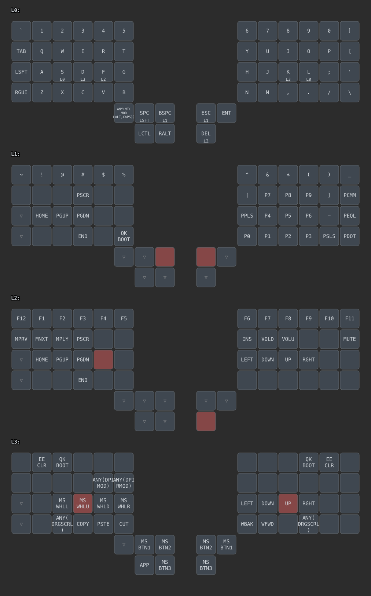

# QMK config for Charybdis keyboard 4x6 with trackball

## Info about keyboard

- Based on [bastardkb charybdis 4x6](https://github.com/Bastardkb/bastardkb-qmk)
- 56 keys and trackball
- Controller: **Splinky v3** (RP2040), target `bastardkb/charybdis/4x6`
- 4 layers (base, symbols/num, media/nav, pointer)

## Repository layout

This repo is a [QMK Userspace](https://docs.qmk.fm/newbs_external_userspace) overlay:

```
qmk.json                                                  # build targets
keyboards/bastardkb/charybdis/4x6/keymaps/optimistic5/
    keymap.json                                           # layers
    source.c                                              # dragscroll-on-hold logic
    pointing.h                                            # layer enum + pointer aliases
    config.h                                              # keymap options
    rules.mk                                              # extra sources / features
```

> Mainline `qmk/qmk_firmware` removed the Splinky board definitions, so this
> config builds against the **BastardKB QMK fork** (`bkb-master` branch), which
> keeps the correct Splinky RP2040 pinout and trackball wiring.

## Build locally (recommended, fast)

These are the exact steps verified on macOS (Apple Silicon).

One-time setup:

```bash
# 1. Cross toolchains (ARM is what the RP2040 Splinky needs; AVR is optional)
brew tap osx-cross/arm && brew tap osx-cross/avr
brew install arm-none-eabi-gcc@8 arm-none-eabi-binutils avr-gcc@8 avr-binutils

# 2. QMK CLI via pip (the Homebrew `qmk` formula bottle is currently broken)
python3 -m venv ~/qmk-venv
~/qmk-venv/bin/pip install qmk

# 3. BastardKB QMK fork as the active QMK home (has the correct Splinky board)
git clone --depth 1 --branch bkb-master https://github.com/Bastardkb/bastardkb-qmk ~/bkb-qmk
~/qmk-venv/bin/qmk config user.qmk_home="$HOME/bkb-qmk"
(cd ~/bkb-qmk && ~/qmk-venv/bin/qmk git-submodule)

# 4. Point QMK at this repo as the userspace overlay
~/qmk-venv/bin/qmk config user.overlay_dir="$(realpath .)"
```

Compile (repeat this after keymap changes). The keg-only toolchains must be on
`PATH`:

```bash
export PATH="$(brew --prefix arm-none-eabi-gcc@8)/bin:$(brew --prefix arm-none-eabi-binutils)/bin:$PATH"
~/qmk-venv/bin/qmk compile -kb bastardkb/charybdis/4x6 -km optimistic5
```

The resulting `bastardkb_charybdis_4x6_optimistic5.uf2` is copied both into the
QMK home directory and into this repo (git-ignored). Tip: add the `PATH` export
and a `qmk` alias to your shell profile so you can just run `qmk compile ...`.

## Build via GitHub Actions

Push to the repo; the workflow in `.github/workflows/build.yml` checks out the
BastardKB fork, builds this keymap, and uploads the `.uf2` as an artifact.

## Editing the keymap

Layers live in `keyboards/bastardkb/charybdis/4x6/keymaps/optimistic5/keymap.json`.
You can edit it by hand, or import/export it via <https://config.qmk.fm/> (set
the keyboard to `bastardkb/charybdis/4x6`). Custom behaviour (hold `S`/`L` for
trackball drag-scroll) lives in `source.c`.

## How to flash firmware to keyboard

- Get the `*.uf2` file (from a local build or the GitHub Actions artifact).
- Unplug your Charybdis from USB-C.
- On the **left** side of keyboard push and hold the **left** top key and plug USB.
- Hold the key until your computer sees a flash drive.
- Copy the firmware to it.
- On the **right** side of keyboard push and hold the **right** top key and plug USB.
- Hold the key until your computer sees a flash drive.
- Copy the firmware to it.
- Done.

## Keymap



This image is generated from `keymap.json` with
[keymap-drawer](https://github.com/caksoylar/keymap-drawer).

### Regenerate the keymap image

One-time setup (keymap-drawer needs Python >= 3.12):

```bash
python3.14 -m venv ~/kd-venv
~/kd-venv/bin/pip install keymap-drawer
brew install librsvg   # provides rsvg-convert for SVG -> PNG
```

Then run the helper script (override tool paths if they are not on `PATH`):

```bash
KEYMAP=~/kd-venv/bin/keymap RSVG=/opt/homebrew/bin/rsvg-convert ./tools/draw-keymap.sh
```

It parses `keymap.json`, draws the layers with the dark theme in
`keymap_drawer.config.yaml`, and writes `keymap.png`. The physical layout comes
from `tools/charybdis_4x6.info.json` (a copy of the keyboard's QMK `info.json`),
so no network or QMK checkout is needed.

## Text editing on macOS

See [TEXT-EDITING.md](TEXT-EDITING.md) for a cheat sheet mapping macOS
cursor-movement, selection, and deletion shortcuts to these layers.
