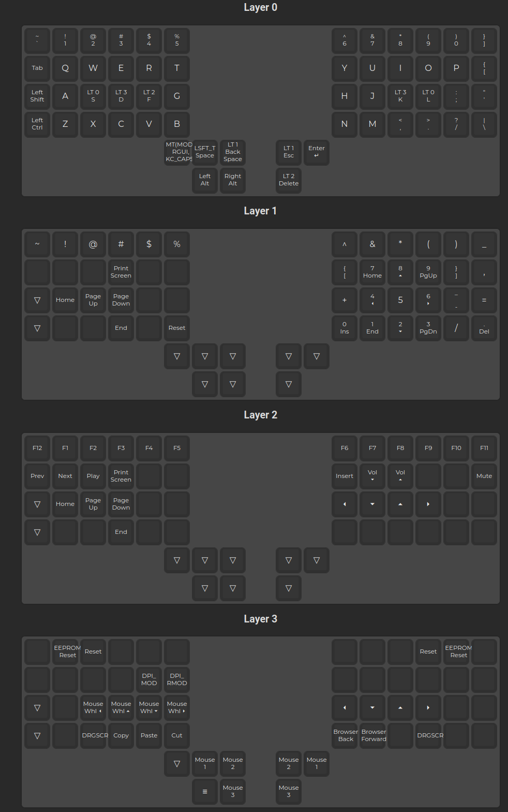

# QMK config for Charybdis keyboard 4x6 with trackball

## Info about keyboard

- Based on [bastardkb charybdis 4x6](https://github.com/Bastardkb/bastardkb-qmk/tree/bkb-master/keyboards/bastardkb/charybdis/4x6/keymaps/via)
- 56 keys and trackball
- firmware based on `bastardkb/charybdis/4x6/v2/splinky_3`
- 3 layers

## How to update keymap and get firmware

- Open <https://config.qmk.fm/>
- Import `keymap.json` to site
- Update keymap
- Export `json`, update your `keymap.json`

> When you do it first time make sure your json has your github username in line `keymap` in `keymap.json` file

After commit, github action will build archive with firmware for you.

## How to flash firmware to keyboard

- Unzip downloaded archive from github, you should get `*.uf2` file
- Unplug your charybdis from USB C
- On the **left** side of keyboard push and hold **left** top key and plug USB
- Hold key untill your computer will see flash drive
- Copy firmware to it
- On the **right** side of keyboard push and hold **right** top key and plug USB
- Hold key untill your computer will see flash drive
- Copy firmware to it
- Done

## Keymap

